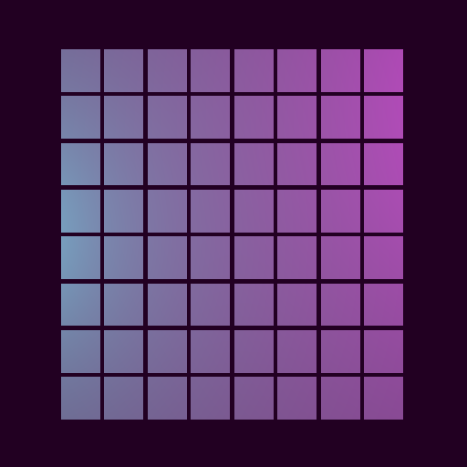

## Creating the grid

Now that you have a function to create your cells, you can focus on the function that will create a grid of cells. To keep things more straightforward, you will create a square grid. Consider the grid for a moment and think about what information you might need to build it.



How many cells tall and wide is the grid? This will be the grid's "size." What size are the cells? And finally, how much space is between the cells?

Some math is required to calculate where to put each of the cells you'll be creating. The position of a mesh is actually that mesh's center point; this will affect how you calculate the position of each cell.

The first three lines of the function below calculate where to place the cells. The total width of a cell is calculated using the size of the mesh and the size of the spacing. The total size of the grid itself is that value multiplied by the number of cells in the grid.

Next, a vector for the mesh size is created. Recall from the previous section that the `buildCellVisual` function copies the information from the vector passed to it. Since every cell is the same size, and the data is copied for each cell, you only need to create a single `THREE.Vector3` with the size
information.

After this, an array is created to store the cells it is about to create. Each element of this array will be another array representing a row of the grid. Each element of that inner array will be a cell mesh.

The function then loops over the grid's rows, calculates the y-axis coordinate, and creates an array to hold the grid rows. Inside this loop is another loop that iterates over the grid's columns, calculates the x-coordinate, and creates a `THREE.Vector3` for the cell's position. The position and size information are then passed to `buildCellVisual`, and the mesh it returns is stored in the array.

Finally, after the function has iterated over every row and column, the cells it created are returned.

```javascript
function buildGridMeshes(gridSize, cellSize, spacing) {
  const cellWithSpace = cellSize + spacing;
  const gridCenter = (gridSize * cellWithSpace) / 2;
  const offset = (cellWithSpace / 2) - gridCenter;

  const meshSize = new THREE.Vector3(cellSize, cellSize, cellSize);

  const cells = [];

  for (let row = 0; row < gridSize; row++) {
    const y = (row * cellWithSpace) + offset;
    cells[row] = [];

    for (let column = 0; column < gridSize; column++) {
      const x = (column * cellWithSpace) + offset;
      const position = new THREE.Vector3(x, y, 0);

      cells[row][column] = buildCellMesh(position, meshSize);
    }
  }

  return cells;
}
```

:::note Arrays in JavaScript
You may have noticed that the `cells` array is used in a row and column fashion rather than x and y like the coordinates. This is because of the way arrays work in JavaScript. To store a grid of data, you have to create an array of arrays. It's a general convention to conceptualize such a structure as a collection of rows that then have columns. There is, however, no technical reason you cannot build this structure as a collection of columns that have rows.
:::
