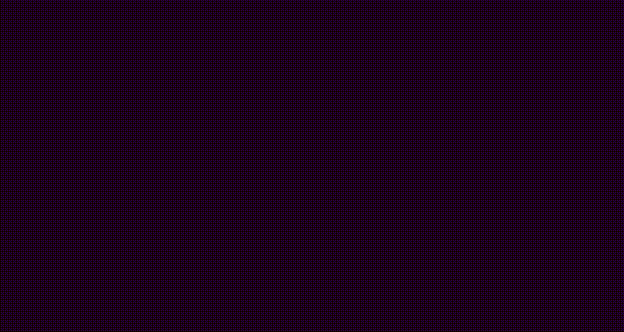

So far, you've done a _lot_ of work, but you haven't been able to see any outcome of that work. The overall goal of this module has been to guide you through building a foundation that can be used both for this tutorial and your future projects.

Now you'll create a quick demo to verify that the code you've assembled is working as intended.

Remove your empty `update` function and replace it with the code below. There are a few things in the code below that you haven't seen yet. You'll learn about these in the next module.

```javascript
// -----------------------------------------------------------------------------
// Demonstration code
// TODO: Remove before proceeding to the next module
const geometry = new THREE.BoxGeometry();
const material = new THREE.MeshStandardMaterial({ color: "#aaaaaa" });
const mesh = new THREE.Mesh(geometry, material);

mesh.position.set(0, 0, -4);

scene.add(mesh);

function update() {
  mesh.rotation.y += 0.0075;
  mesh.rotation.x += 0.0075;
}
// -----------------------------------------------------------------------------
```

After you copy and paste this code into your code playground, run the code. If you have assembled everything correctly, you'll see a rotating cube like the one in the figure below.



If you don't see a rotating cube, review your code to make sure you didn't miss anything during assembly. You can also compare your code with the code listed in this module's [checkpoint](./checkpoint.mdx).

When you're done with the demo, replace its code with the empty `update` function from the previous section:

```javascript
function update() {
  // Your project's animation code will go here.
}
```
