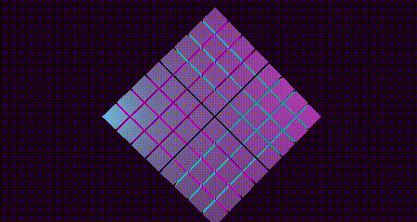

You are now ready to begin adding objects to your 3D scene. In this module, you will add objects to your 3D scene, group them together, and then rotate the group as a whole. At the end of this module, you will have created the 3D scene shown below.

Up till now, the work you have done has been general enough that you can reuse it in your future projects. Going forward, you will begin assembling code that is more specific to the project at hand.

## Planning your project

As you think about this project and your own future projects, you will find it helpful to think about how you can break the idea into smaller chunks of work. Doing this will create good places to take a break and collect your thoughts. It will also provide places for a project to branch and allow you to explore several ideas.

The first chunk of this tutorial was about building a foundation. But there's still a big gap between that and the end state that was illustrated in the introduction. What's a good in-between goal?

Your end goal is a rotating grid of cubes that are each growing or shrinking on their own. That can be broken into two distinct chunks: adding a grid of cubes, and giving those cubes a behavior. Either could be done first. However, if you added the behavior code first, you wouldn't be able to see if it was working as expected.

By starting with the grid of cubes, you will have the means to see the behavior code in action when you add it. This also puts you in a good place to experiment before moving on to adding behavior, if you choose.
