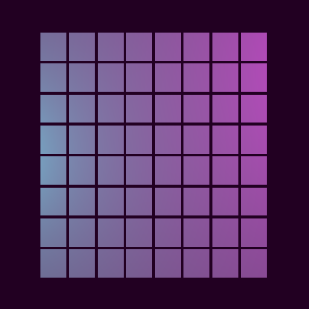

## Creating the grid

Now that you have a function to create your cells, you can focus on the
function that will create a grid of cells. Consider the grid for a moment and
think about what you information you might need to build it.



```javascript
/**
 * Create a square grid of cell visuals.
 *
 * @param {number} gridSize the width of the grid in cells
 * @param {number} maxSize the maximum size of a cell visual in three.js
 *        units
 * @param {number} spacing how much space, in three.js units, to place between
 *        each cell visual
 * @returns {Array<Array<THREE.mesh>>} a two dimensional array of the cell
 *         visuals
 */
function buildGridVisuals(gridSize, maxSize, spacing) {
  const fullSize = maxSize + spacing;
  const halfSize = fullSize / 2;
  const viewSize = gridSize * fullSize;
  const offset = (gridSize * fullSize) / 2;

  const visualSize = new THREE.Vector3(maxSize, maxSize, maxSize);
  let cells = [];

  for (let x = 0; x < gridSize; x++) {
    const visualX = x * fullSize + halfSize - offset;
    cells[x] = [];

    for (let y = 0; y < gridSize; y++) {
      const visualY = y * fullSize + halfSize - offset;
      const visualPosition = new THREE.Vector3(visualX, visualY, 0);

      cells[x][y] = buildCellVisual(visualPosition, visualSize);
    }
  }

  return cells;
}
```

| TBD: Graphic Asset |
| -- |
|  |
| Diagram for object layout math |
