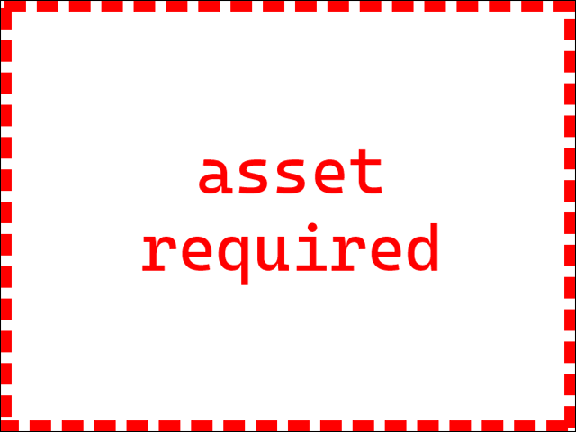

The objects you will be working with in this tutorial are cubes. However, they
don't have to be cubes, and when a generic term is more appropriate, the term
"cell" will be used.

## Vectors

You are about to start using vectors, and you will encounter them frequently
when working with computer graphics. Vectors, as you will use them in this
tutorial, are a group of numbers. You will use a three number vector to store
an object's x, y, and z coordinates as a single unit. You will also use a vector
to store the size of an object on its x, y, and z axes.

## Creating individual cells

```javascript
/**
 * Creates the 3D model of an individual cell with a given position and size.
 *
 * @param {THREE.Vector3} position the cell's position in 3D space
 * @param {THREE.Vector3} size the cell's size
 * @returns {THREE.Mesh} the 3D mesh to add to the scene
 */
 function buildCellVisual(position, size) {
  const geometry = new THREE.BoxGeometry();
  const material = new THREE.MeshStandardMaterial({ color: "#aaaaaa" });
  const mesh = new THREE.Mesh(geometry, material);

  mesh.position.copy(position);
  mesh.scale.copy(size);

  return mesh;
}
```

```javascript
/**
 * Create a square grid of cell visuals.
 *
 * @param {number} gridWidth the width of the grid in cells
 * @param {number} maxCellSize the maximum size of a cell visual in three.js
 *        units
 * @param {number} spacing how much space, in three.js units, to place between
 *        each cell visual
 * @returns {Array<Array<THREE.mesh>>} a two dimensional array of the cell
 *         visuals
 */
function buildGridVisuals(gridWidth, maxCellSize, spacing) {
  const fullSize = maxCellSize + spacing;
  const halfSize = fullSize / 2;
  const viewSize = gridWidth * fullSize;
  const offset = (gridWidth * fullSize) / 2;

  const visualSize = new THREE.Vector3(maxCellSize, maxCellSize, maxCellSize);
  let cells = [];

  for (let x = 0; x < gridWidth; x++) {
    const visualX = x * fullSize + halfSize - offset;
    cells[x] = [];

    for (let y = 0; y < gridWidth; y++) {
      const visualY = y * fullSize + halfSize - offset;
      const visualPosition = new THREE.Vector3(visualX, visualY, 0);

      cells[x][y] = buildCellVisual(visualPosition, visualSize);
    }
  }

  return cells;
}
```


