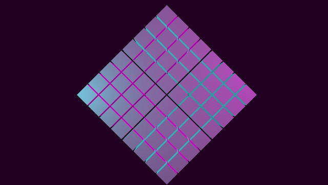

You now have code that will create a number of cells arranged as a grid in your 3D scene. Recall that the desired result is to have those cells tilted on a corner and, eventually, to have them rotate as a group around a central axis.



## Grouping the cells

You can move all of your cells together by grouping them, and three.js provides the tools to do this. It is also a straightforward process. The function below creates a new group, iterates over the rows and columns of your cell grid, and adds each cell to the group.

It then rotates the entire group 45 degrees before returning the group object. Keep in mind that rotation in three.js is specified in radians. The radian is a unit of angular measurement, and the number of radians in half a circle (180 degrees) is equal to the mathematical constant &pi; (`Math.PI` in JavaScript).

This is a short function, and you may wonder why it was not simply combined with the `buildGridMeshes` function in the previous section. Because the end goal is to add behavior to the individual cells of the grid, you need to maintain access to the original nested array of cells. It will be harder to access these cells if only the group object is available.

```javascript
 function groupCellMeshes(cells) {
  const cellGroup = new THREE.Group();

  for (const cell of cells.flat()) {
    cellGroup.add(cell);
  }

  // Tilt the group 45 degrees (in radians)
  cellGroup.rotation.z = Math.PI / 4;

  return cellGroup;
}
```

:::note Array flattening
The function above iterates over a flattened copy of the `cells` array. The group object doesn't have any knowledge of which row and column each cell is located at. So in this case, you can use the `.flat()` method to simplify your code. See the "[Additional resources](./../wrapping-up/additional-resources.mdx)" section for more information about array flattening.
:::

## Displaying the cells

You're ready to actually display these cells now. To start, you'll need to define a few constant values. You will use some of these values again later when you begin adding behavior to your scene. Since they will be defined as constants, you will only have to change them in one place when you begin experimenting with your project.

The first thing you need is your grid size. This is the number of rows and columns that will be in the cell grid.

```javascript
const GRID_SIZE = 8;
```

Next, define how large your cells will be. Notice that the name of this constant indicates this is a maximum. In the next module, you will cause the cells to grow and shrink. This value will be the limit of how large they can grow.

```javascript
const MAX_CELL_SIZE = 1.0;
```

Finally, you need to decide how far apart each cell should be. There is nothing special about this number, and the spacing is purely aesthetic. For this tutorial, set the spacing to one tenth the maximum size.

```javascript
const CELL_SPACING = MAX_CELL_SIZE / 10;
```

Now create the cell meshes, group them together, and then add the group to the
scene. You created the `scene` variable in the [previous module](./../scene-setup/put-it-together.mdx).

```javascript
const cellMeshes = buildGridMeshes(GRID_SIZE, MAX_CELL_SIZE, CELL_SPACING);
const cellGroup = groupCellMeshes(cellMeshes);

scene.add(cellGroup);
```

## Positioning the camera

If you ran your code right now, you wouldn't see anything. The camera you created in the [previous module](./../scene-setup/put-it-together.mdx) is located at its default location: (0, 0, 0), and it was set to "look at" the position (0, 0, 0) as well. This means that at the moment all the cells you just created are out of view.

You will need to move it far enough away from your grid so that all the cells are visible. You only need to change the camera's z-axis position to do this, and leaving the x-axis and y-axis positions as is will keep the grid centered on the screen.

A good starting distance will be the grid size multiplied by the sum of the cell size and the cell spacing.

```javascript
camera.position.set(0, 0, GRID_SIZE * (MAX_CELL_SIZE + CELL_SPACING));
```

Run your code now, and your scene will look like the image below.


