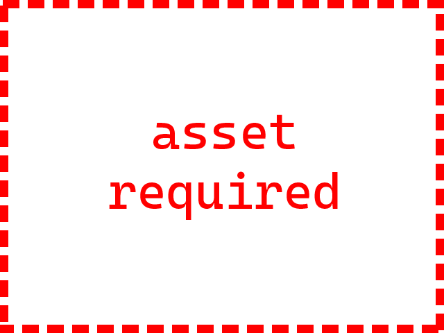

In this module, you will build the foundation that you will build the remainder
of the tutorial. This part isn't exciting, but what's covered in this section
is necessary. It will be useful when you begin experimenting on your own.

When you complete this module, you will have a reusable template that you can
use as the basis for future projects. At the end of the module, you will create
a short demo with a rotating cube to verify that everything is working.

## 3D scene basics

All three-dimensional graphics scenes have some core elements in common
regardless of which graphics library you are using.

* One or more objects to be the subject of the scene. These are the things you
  want people to see when they look at what you've created. This could be
  something simple such as a single cube or a complex animation of many detailed
  objects.
* One or more light sources so the objects in the scene will be visible. There
  are situations where the absence of a light source can be used for artistic
  intent, but you will use light sources in this tutorial.
* A camera to provide a view of the scene. What the camera "sees" is what gets
  displayed on your display.
* A scene to contain the objects, lights, and camera. The scene is an a
  container that coordinates the various items that affect what gets shown on
  your display.
* A renderer to translate the three-dimensional scene into pixels on your
  display.
* An animation loop to keep your scene updated.

:::note
Strictly speaking, lights are not required in a scene. There are situations
where the absence of a light source can be used for artistic intent. For
example, you could create a scene with a light background where all the objects
appeared as silhouettes because there are no lights. It is also possible to
create objects that glow.

These are things to experiment with as you continue to explore 3D graphics. For
this tutorial, you will use light sources.
:::

## How to skip ahead

If you would rather jump directly to the visuals and skip the construction of
the foundation, you can do that. At the end of this module, you will find a
[checkpoint](./checkpoint.md) for this module. That page contains the complete
HTML, CSS, and JavaScript code that is built in this module. Copy and paste each
code block into the appropriate panel of your code playground. You will then be
ready to jump directly into the next module.

Return to this module when you are ready to review how this code was put
together.
