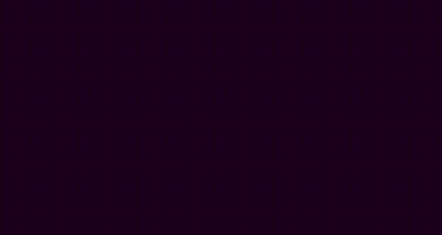

In this module, you will build the foundation that you will use to build the
rest of the tutorial. This part isn't exciting, but what's covered in this
section is necessary. What you build in this module will be useful when you
begin experimenting on your own.

When you complete this module, you will have a reusable template that you can
use as the basis for future projects. At the end of the module, you will create
a short demo with a rotating cube to verify that everything is working.

## 3D scene basics

All three-dimensional graphics scenes have some core elements in common
regardless of which graphics library you are using. You will learn about all of
these in the first module, "[Setting up a scene](./../scene-setup/)", except for
meshes, which will be covered in the second module,
"[Adding objects](./../adding-objects/)".

### Meshes

One or more meshes are needed to be the subject of the scene. These are the
objects you want people to see when they look at what you've created. This could
be something simple such as a single cube or a complex animation of many
detailed objects.

Meshes are mathematical models of the things you want to show in your scene.
The combine both the geometry of an object with the "material" or appearance of
the object. Fortunately, the vast majority of this math is handled for you by
three.js.

As noted above, you will learn more about meshes in the second module of this
tutorial.

### Lights

One or more light sources are needed so the objects in the scene will be
visible. Lights can have colors and types (e.g., point lights and spotlights).

Strictly speaking, lights are not required in a scene. There are situations
where the absence of a light source can be used for artistic intent. For
example, you could create a scene with a light background where all the objects
appeared as silhouettes because there are no lights. It is also possible to
create objects that glow.

These are things to experiment with as you continue to explore 3D graphics. For
this tutorial, you will use two light sources.

### Camera

The camera provides a view of the scene, and it works in a manner analogous to
real world cameras. What the camera "sees" is what gets displayed on your
display.

There are many types of cameras, and you can even have more than one in a scene
and switch between them. For this tutorial, we will use a single camera.

### Scene container

When you create a 3D scene, there is an invisible container that holds
everything you want to display (your meshes) and everything that affects that
display (such as your lights and camera). An apt metaphor for this container is
a theater stage.

This container is usually just called a "scene," and it's how your computer
makes sense of the items on this stage.

### Renderer

The renderer is what translates your 3D scene into pixels on your display. It
is the bridge between the mathematical models of the objects in your scene and
the hardware that generates images on your display.

In this tutorial, you will use a WebGL renderer. WebGL is a technology that
web browsers use to display 3D graphics. Again, this is something that three.js
takes care of for you.

### Animation loop

The animation loop is an activity that your computer carries out every time it
updates the image on your display. With every update, your computer will ask
your scene to perform any necessary updates and will then render a new version
of your screen.

This process is akin to stop-motion animation used in film. A character model is
set up, a picture is taken, the stage crew makes slight movements to the model,
and takes a new picture. When these pictures are shown rapidly in sequence, the
viewer sees an animated scene. The principle of the animation loop is similar,
but it happens in real time.

## How to skip ahead

If you would rather jump directly to the visuals and skip the construction of
the foundation, you can do that. At the end of this module, you will find a
[checkpoint](./checkpoint.mdx) for this module. That page contains the
complete HTML, CSS, and JavaScript code that is built in this module. Copy and
paste each code block into the appropriate panel of your code playground. You
will then be ready to jump directly into the next module.

Return to this module when you are ready to review how this code was put
together.
